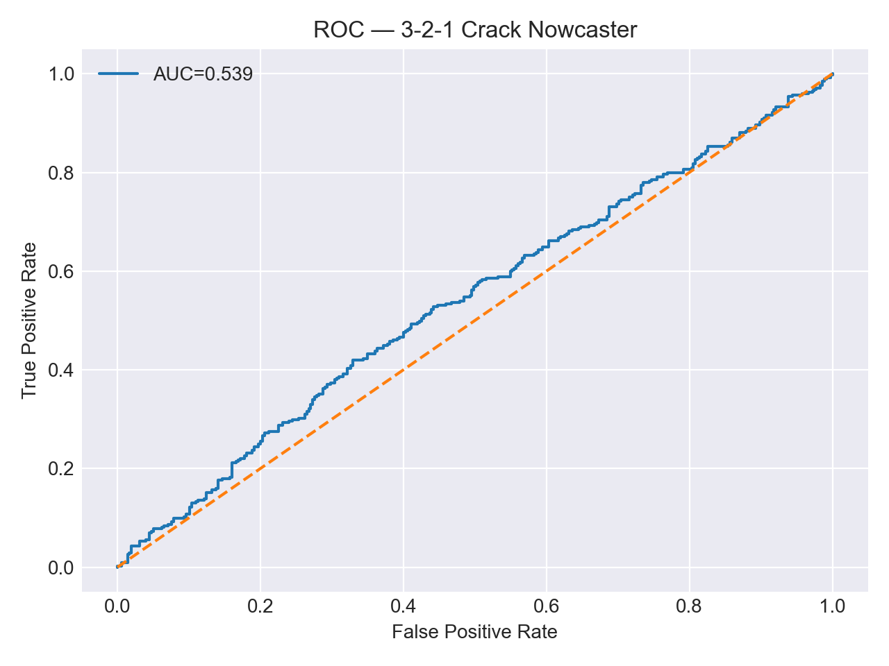
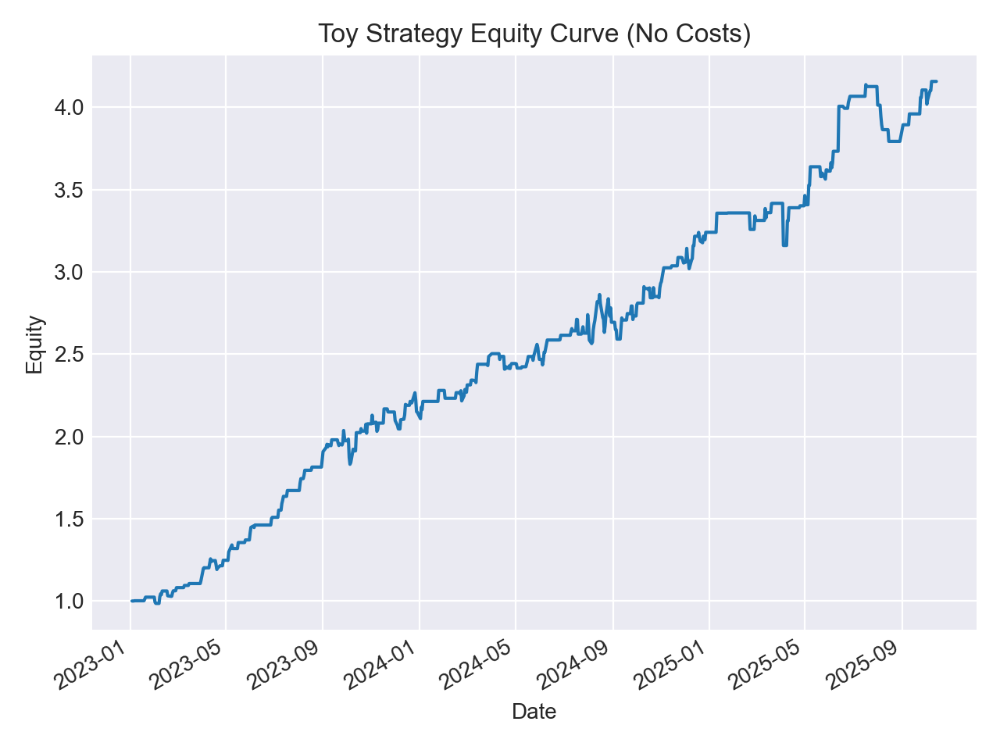

# 3-2-1 Crack Spread Nowcaster ⛽📈

**Goal:** Predict the *next-day direction* of the refinery crack spread —  
defined as:  
> **CRACK = 2 × RBOB + 1 × ULSD − 3 × WTI**

using simple, interpretable ML features.

> **Stack:** Python · pandas · scikit-learn · yfinance · matplotlib  
> **Data:** Yahoo Finance continuous front-month futures (`CL=F`, `RB=F`, `HO=F`)  
> **ML Type:** Supervised binary classification (time-series → tabular engineered features)

---

## 🚀 Quickstart

```bash
python -m venv venv && source venv/bin/activate
pip install -r requirements.txt
# Then open and run:
# notebooks/01_crack_spread_nowcaster.ipynb
📊 Results (Out-of-sample test ≥ 2023-01-01)
Metric	Value
Accuracy	0.540
Precision	0.541
Recall	0.443
AUC	0.539

ROC (Test)

Diagnostic Equity Curve (No Costs)

This is a signal study for directional nowcasting.
It does not model contract rolls, carry, or execution costs.
Target = up/down, not P&L.

⚙️ Method (Short)
Label: 1 if CRACK(t+1) > CRACK(t), else 0

Features: 5/10/20-day returns & z-scores for CL/RB/HO and the crack; weekday & month

Model: StandardScaler → LogisticRegression(max_iter=1000)

Validation: Time-based split (train ≤ 2022-12-31, test ≥ 2023-01-01). No shuffling, no leakage.

🧠 Why It Matters
The crack spread ≈ refinery gross margin.
Signals tie directly to energy market dynamics:

Gasoline strength (RB ↑) → crack ↑

Crude strength (CL ↑) → crack ↓ (feedstock cost squeeze)

📁 Repo Structure
markdown
Copy code
notebooks/
  01_crack_spread_nowcaster.ipynb
  figures/
    roc_curve.png
    equity_curve.png
  reports/
    metrics.json
requirements.txt
README.md
LICENSE
.gitignore
🔮 Roadmap (Next Steps)
Add baselines: majority class, 1-day crack momentum, always-long diagnostic.

Threshold tuning: pick decision threshold via F1/Youden index.

Walk-forward AUC: expanding-window backtest.

Interpretability: rank top coefficients with market intuition.

Ablation study: base vs +ratios (RB/CL, HO/CL) vs +volatility features.

(Optional) Add lagged EIA weekly inventory deltas.

⚖️ License
This project is licensed under the MIT License (see LICENSE).

The MIT License allows anyone to use, copy, modify, and redistribute this code — including commercially —
as long as they keep the license notice. It also disclaims all warranties and liability.

Built by Praabveer — feedback welcome.